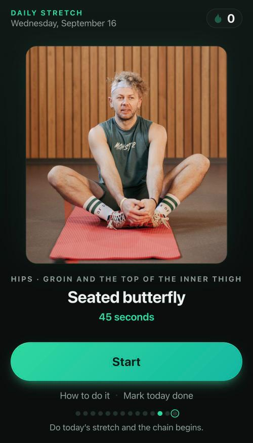
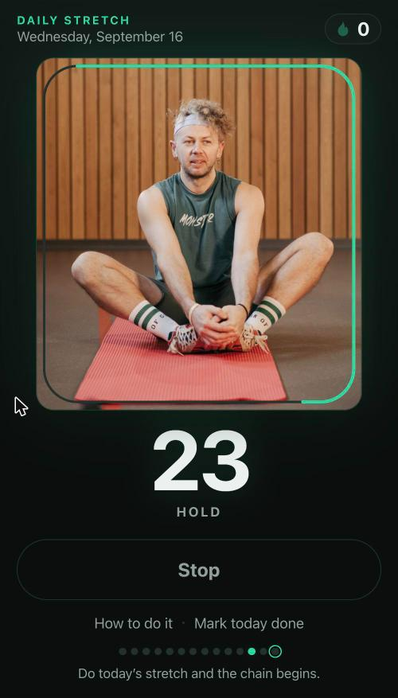
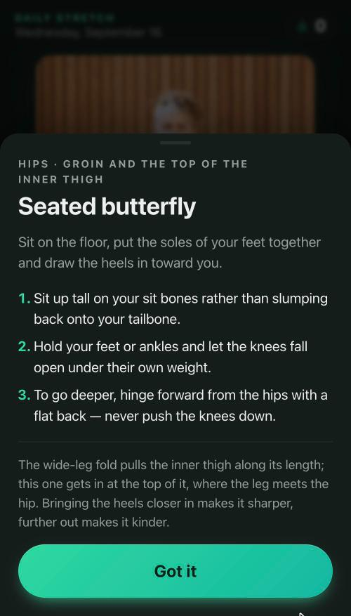

# Stretch

One stretch a day. Not a routine — one.

**→ [stretch.juhawilppu.com](https://stretch.juhawilppu.com/)**

<p align="center">
  
  
  
</p>

## Why this exists

I am forty, I have written software for a living for most of my adult life, and
the body that comes with that job is stiffening in ways I can now feel. The
remedy is not a secret. The problem is that a twenty-minute stretching routine is
exactly the kind of thing you skip, and something you skip four days in five is
worth less than something small you never skip at all.

So the app shows exactly one stretch. A photograph of it, how to do it, a
countdown for the hold, and a streak. A day costs forty-five seconds — small
enough that there is never a good reason to skip it.

This is a tool for one person, and that person is me. No sign-up, no accounts, no
analytics, no server, nothing to promote and nobody to grow. The streak is one
line in one browser's storage and it has never left the phone. That is a
deliberate ceiling, not an unfinished roadmap.

## What it does

- **The day picks the stretch.** The same move however often you open the app
  that day, a different one tomorrow, and all five inside a week. It is not a
  menu, and there is nothing to reload your way out of.
- **Nothing to fetch.** Every move is done on bare floor with empty hands — no
  mat, no strap, no wall, nothing to kneel on. Fetching kit for a single stretch
  is exactly the errand that turns a daily habit into a skipped one.
- **A countdown for the hold**, with a chime at the end and the screen kept awake
  while it runs.
- **A streak**, stored locally, and a finish screen that makes a point of it.
- **Installs to a home screen** and runs full screen and offline. A hallway with
  one bar of signal is exactly where it gets used.

| Stretch | | Hold |
|---|---|---|
| Standing forward fold | hamstrings, calves and the back of the legs | 45s |
| Seated wide-leg fold | adductors, inner thigh and groin | 45s |
| Seated butterfly | groin and the top of the inner thigh | 45s |
| Seated forward fold | hamstrings, calves and the lower back | 45s |
| Standing overhead reach | shoulders, ribs and spine | 40s |

Five, because a short list is one you actually learn — the form stops being
something you read off the screen and becomes something you know. Between them
they cover what a day at a desk and an evening on a bike shorten: the back of the
legs gets it twice, standing and sitting; the inner thigh, which gets no range at
all on a bike, gets it twice as well; and the overhead reach is the counter to the
shape a keyboard and a set of handlebars both put you in.

## It is completely vibe-coded

Every line of this — the app, the tests, the deploy script, the icon, this README
— was written by [Claude Code](https://claude.com/claude-code). I did not type
the code. What I did was decide what the thing should be and refuse the versions
that were not it: cut the list from twenty-odd stretches to five, throw out every
move that needed a mat or a strap, replace random selection with a rotation the
day chooses so the app cannot be re-rolled, drop the drawn stick figures once real
photographs turned out to teach the pose better, and reject photographs showing
form the instructions warn against.

I am putting that on the label rather than in a footnote, because I think the
honest version is the interesting one. The taste, the scope and the calls about
what to leave out are mine; the typing was not. I like the end result more than I
expected to, and I use it every day.

## How it is built

No framework, no dependencies, no build step, no bundler — around 1,500 lines of
plain HTML, CSS and ES5-flavoured JavaScript, served as the files they are. For an
app this size a toolchain would have been more moving parts than app.

```sh
python3 -m http.server 8765     # then open http://localhost:8765
node days.test.js               # the tests
```

The tests cover the part that is genuinely easy to get wrong: calendar days stay
consecutive across a daylight-saving change and survive a round trip through
storage, every stretch has cues, a sane hold length and a photograph that is
actually in the repo, and the colour handed to the browser chrome is the colour
the page really starts with. `days.js` is deliberately separate from the app so it
can be tested with bare `node`, no browser and no test framework.

| File | |
|---|---|
| `index.html` | the single screen |
| `styles.css` | layout, light and dark themes |
| `stretches.js` | the five stretches — cues, hold lengths, why each one matters |
| `photos/` | one photograph per stretch, with credits |
| `days.js` | calendar-day helpers, kept testable outside a browser |
| `app.js` | rendering, the timer, the streak |
| `manifest.webmanifest`, `sw.js` | installable, and cached so it runs offline |
| `_headers` | keeps Cloudflare from holding on to the manifest |
| `deploy.sh` | assembles `deploy/` and publishes it |

## How deployment works

Cloudflare Pages, direct upload. One command:

```sh
./deploy.sh
```

That runs the tests, assembles a `deploy/` directory from just the files a browser
needs — the README, the screenshots and the tests stay off the published site —
and uploads it with `wrangler`. `deploy/` is generated, so it is gitignored rather
than committed.

Pushing to `master` does **not** publish. The Pages project is direct-upload
rather than wired to the repo, so a deploy is always an explicit `./deploy.sh`.
(The Pages project still carries this repo's original name, `daily-stretch`.)

The one non-obvious part is cache busting. Cloudflare serves `index.html` with
`max-age=0` but scripts, styles and photographs with a four-hour TTL, so without
help a returning visitor can spend four hours pairing a fresh `index.html` with a
stale `app.js` — which breaks the page rather than merely dating it. So the deploy
stamps the commit hash onto every asset URL, names the service worker's cache
after the commit, and registers the worker under a URL carrying the commit too,
since Pages keeps its own TTL on anything `.js` whatever `_headers` says. Each
deploy is therefore a set of files that can only load together.

## Reminders

Installing the app does not bring a reminder with it, and nothing the app can do
will add one: a web app cannot schedule a local notification, cannot ask iOS to
wake it, and cannot create an automation. The reminder is made once by hand — an
iOS Shortcuts automation, **Time of Day**, 20:00 daily, **Show Notification**.

It fires whether or not the stretch is already done, because nothing on the phone
can see into the app's storage to check. Making it conditional would take a
server: the app reporting each finished day, the automation asking it, a push when
the answer is no. That is the trade this app declines. A reminder that knows
whether you have stretched is a reminder that knows when you are home, kept on
someone else's computer. An extra notification on a day you have already done it
is the cheaper price.

## Credits

Photographs are from [Pexels](https://www.pexels.com/license/), free to use
without attribution; the photographers are credited anyway in
[`photos/CREDITS.md`](photos/CREDITS.md).
